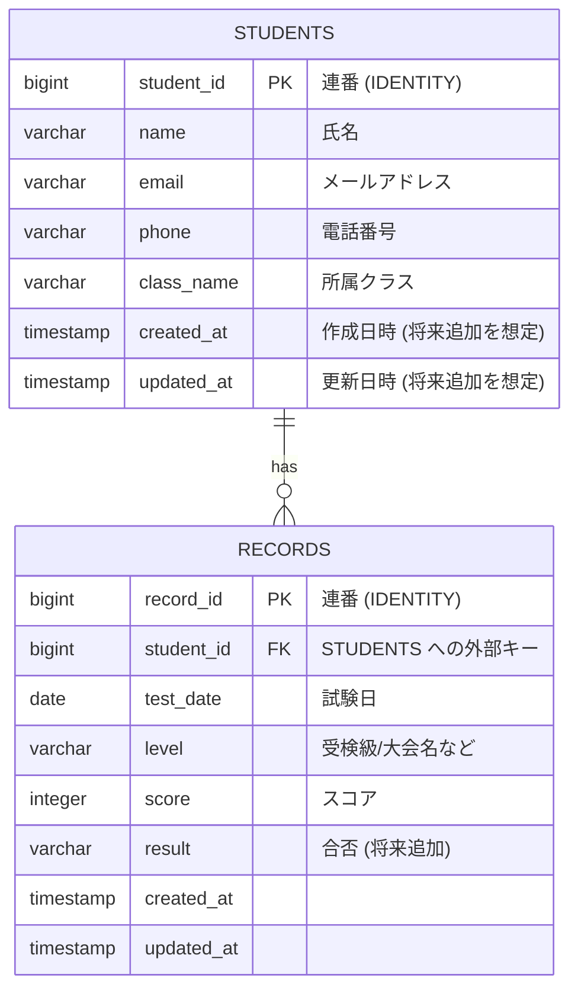
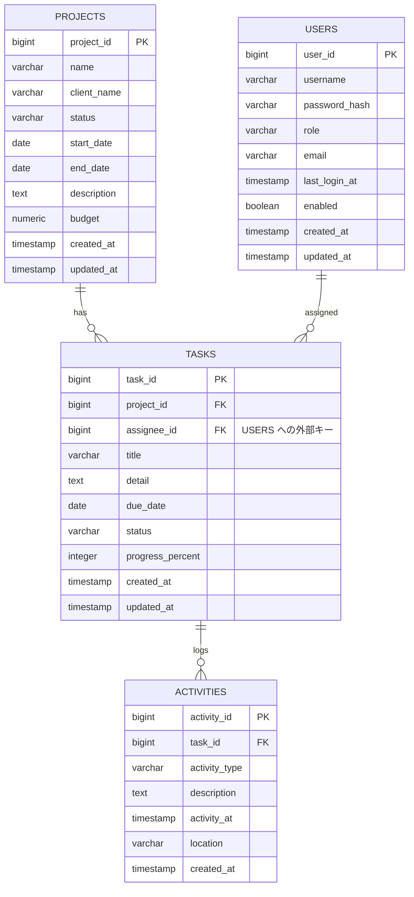

# ER 図詳細

Training CRM のデータモデルを現在実装済みのテーブルと、今後拡張予定のテーブルに分けて整理します。Mermaid で ER 図を示し、各テーブルのカラム・型・役割をまとめています。

---

## 1. 現在のデータモデル

### STUDENTS テーブル

| カラム         | 型        | Not Null | 備考                               |
|----------------|-----------|----------|------------------------------------|
| `student_id`   | BIGINT    | ○        | 主キー。既存エンティティでは `@GeneratedValue` |
| `name`         | VARCHAR   | ○        | 50 文字程度を想定                   |
| `email`        | VARCHAR   | △        | 必須要件は要検討。ユニーク制約も検討対象 |
| `phone`        | VARCHAR   | △        | フォーマット検証は今後の課題        |
| `class_name`   | VARCHAR   | △        | 所属クラス名                        |
| `created_at`   | TIMESTAMP | -        | 監査列として追加予定                |
| `updated_at`   | TIMESTAMP | -        | 同上                                |

### RECORDS テーブル

| カラム         | 型        | Not Null | 備考                                           |
|----------------|-----------|----------|------------------------------------------------|
| `record_id`    | BIGINT    | ○        | 主キー                                         |
| `student_id`   | BIGINT    | ○        | `STUDENTS.student_id` への外部キー             |
| `test_date`    | DATE      | ○        | 試験・記録会の日付                             |
| `level`        | VARCHAR   | ○        | 受検級または大会種別                           |
| `score`        | INTEGER   | △        | 成績点数（未入力を許容する場合 △）            |
| `result`       | VARCHAR   | -        | 合否ステータス（"PASSED" など）               |
| `created_at`   | TIMESTAMP | -        | 監査列。Spring Data JPA の `@CreatedDate` で運用可 |
| `updated_at`   | TIMESTAMP | -        | 同上                                           |

---

## 2. 拡張予定のデータモデル

### 2.1 プロジェクト管理モジュール

#### PROJECTS テーブル

| カラム           | 型        | Not Null | 備考                                       |
|------------------|-----------|----------|--------------------------------------------|
| `project_id`     | BIGINT    | ○        | 主キー                                     |
| `name`           | VARCHAR   | ○        | 案件名                                     |
| `client_name`    | VARCHAR   | ○        | 自治体名または発注元                       |
| `status`         | VARCHAR   | ○        | `PLANNING` / `IN_PROGRESS` / `CLOSED` 等    |
| `start_date`     | DATE      | △        | 開始日                                     |
| `end_date`       | DATE      | △        | 終了予定日                                 |
| `description`    | TEXT      | -        | 概要                                       |
| `budget`         | NUMERIC   | -        | 金額（必要に応じて精度を設定）             |
| `created_at`     | TIMESTAMP | -        | 監査列                                     |
| `updated_at`     | TIMESTAMP | -        | 監査列                                     |

#### TASKS テーブル

| カラム               | 型        | Not Null | 備考                                             |
|----------------------|-----------|----------|--------------------------------------------------|
| `task_id`            | BIGINT    | ○        | 主キー                                           |
| `project_id`         | BIGINT    | ○        | `PROJECTS.project_id` への外部キー               |
| `assignee_id`        | BIGINT    | △        | 担当者。`USERS.user_id` を参照                   |
| `title`              | VARCHAR   | ○        | タスク名                                         |
| `detail`             | TEXT      | -        | 詳細メモ                                         |
| `due_date`           | DATE      | △        | 期限                                             |
| `status`             | VARCHAR   | ○        | `TODO` / `DOING` / `DONE` 等                     |
| `progress_percent`   | INTEGER   | -        | 進捗率（0〜100）                                 |
| `created_at`         | TIMESTAMP | -        | 監査列                                           |
| `updated_at`         | TIMESTAMP | -        | 監査列                                           |

#### ACTIVITIES テーブル

| カラム          | 型        | Not Null | 備考                                         |
|-----------------|-----------|----------|----------------------------------------------|
| `activity_id`   | BIGINT    | ○        | 主キー                                       |
| `task_id`       | BIGINT    | ○        | `TASKS.task_id` への外部キー                 |
| `activity_type` | VARCHAR   | △        | `MEETING` / `CALL` / `VISIT` 等               |
| `description`   | TEXT      | ○        | 行動記録の本文                                |
| `activity_at`   | TIMESTAMP | ○        | 活動日時                                     |
| `location`      | VARCHAR   | -        | 実施場所（任意）                              |
| `created_at`    | TIMESTAMP | -        | 登録日時                                      |

#### USERS テーブル

| カラム            | 型        | Not Null | 備考                                              |
|-------------------|-----------|----------|---------------------------------------------------|
| `user_id`         | BIGINT    | ○        | 主キー                                            |
| `username`        | VARCHAR   | ○        | ログイン ID。ユニーク制約                         |
| `password_hash`   | VARCHAR   | ○        | パスワードハッシュ（BCrypt 推奨）                 |
| `role`            | VARCHAR   | ○        | `ADMIN` / `STAFF` など                            |
| `email`           | VARCHAR   | △        | 連絡先メール                                     |
| `last_login_at`   | TIMESTAMP | -        | 最終ログイン日時                                 |
| `enabled`         | BOOLEAN   | ○        | アカウント有効フラグ                              |
| `created_at`      | TIMESTAMP | -        | 登録日時                                         |
| `updated_at`      | TIMESTAMP | -        | 更新日時                                         |

---

## 3. 実装優先度と依存関係

1. **学生・成績モジュール**: 既存コードをベースに監査列やバリデーション列を拡張。
2. **ユーザ/認証基盤**: Spring Security の有効化準備として `USERS` テーブルを先行で実装。
3. **案件モジュール**: `PROJECTS` → `TASKS` → `ACTIVITIES` の順で段階的に追加。REST API と Thymeleaf の双方を想定。
4. **分析ダッシュボード**: 成績推移や案件進捗を集計するビュー/SQL を後続で設計。

---

## 4. 今後検討したいポイント

- 日付や金額のロケール対応（日付フォーマット、通貨単位）
- 監査列の自動セット（Spring Data JPA `@EntityListeners` の利用）
- 外部キー制約と ON DELETE / ON UPDATE の挙動
- 参照整合性＋ユニーク制約（メールアドレス、ユーザ名など）
- 将来的なマルチテナント対応の必要性（自治体ごとに分ける場合）

上記を基に ER 図とスキーマ定義を具体化し、今後の実装フェーズに備えます。
